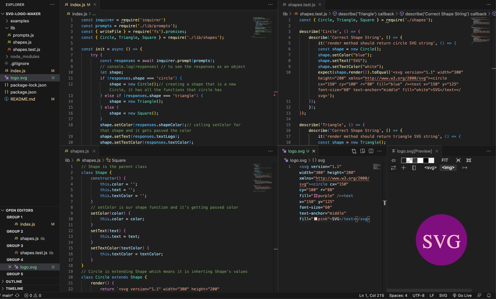

# SVG Logo Maker
> This is a Node.js command-line application that takes user input to generate a logo and save it as an SVG file.  Tests on the back end have been created, as well.
> Walkthrough Video [_here_](https://drive.google.com/file/d/1SiUwtdxptFIgrANtEZa2FIWCozDHGuHs/view). <!-- If you have the project hosted somewhere, include the link here. -->

## Table of Contents
* [General Info](#general-information)
* [Technologies Used](#technologies-used)
* [Features](#features)
* [Screenshots](#screenshots)
* [Setup](#setup)
* [Usage](#usage)
* [Project Status](#project-status)
* [Room for Improvement](#room-for-improvement)
* [Acknowledgements](#acknowledgements)
* [Contact](#contact)
<!-- * [License](#license) -->

## General Information
<!-- You don't have to answer all the questions - just the ones relevant to your project. -->
First, the user will be prompted with a question asking to enter the text of the logo which can be up to 3 characters and to enter the color keyword or hexadecimal number for the color's text.  Then, the user will be asked to choose from a list of shapes: circle, triangle, or square. They will use the arrow keys, and hit enter to select one.  After that, the user will enter a color keyword or hexadecimal number for the shape's color.  Once all the information is inputted, an SVG file will be created generating the image reflecting the choices made by the user (text, shape, and colors).  For the back end, each shape class is tested using Jest for a render method that returns a string for the corresponding SVG file with the given shape color, text, and text color.  All tests are passing.

## Technologies Used
- Node.js
- Inquirer 8.2.4
- Jest 29.5.0

## Features
- User can input text, text color, choose a shape and input shape's color to generate a logo in an SVG file.
- A 300 x 200 pixel image matching the criteria the user entered is generated.
- Testing using Jest on the back end has been created and all are passing.

## Screenshots

<!-- If you have screenshots you'd like to share, include them here. -->

## Setup
In order to use this application, the following are required:
- Node
- Node package modules
- Inquirer 8.2.
- Jest
- File System module 

## Usage
`node index.js` Type in the answer to the questions.  When prompted to choose a shape, use the arrows to select circle, triangle, or square then hit enter.

`npm i` to install Jest

`npm run test`

## Project Status
Project is: _in progress_.

## Room for Improvement
- Text to be more centered

## Acknowledgements
- Many thanks to my instructor, Michael Pacheco, the TAs, Nirav and Julius, the tutor Katie Redford, and all the AskBCS learning assistants.

## Contact
Created by Kristine Kim.  Feel free to contact me at kristinehkim@gmail.com!

<!-- Optional -->
<!-- ## License -->
<!-- This project is open source and available under the [... License](). -->

<!-- You don't have to include all sections - just the one's relevant to your project -->